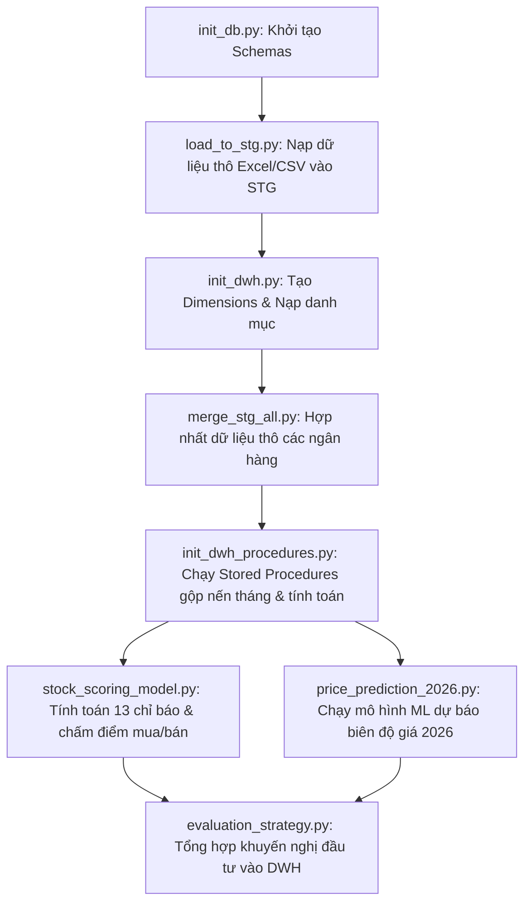

# Báo cáo Tổng quan Dự án: Phân tích & Dự phóng Cổ phiếu Ngân hàng

## 1. Ngữ cảnh (Context)
Dự án được khởi xướng xuất phát từ **nhu cầu thực tế của một nhóm nhà đầu tư** quan tâm sâu sắc đến nhóm cổ phiếu ngân hàng (đặc biệt là các ngân hàng có trụ sở hoặc tầm ảnh hưởng lớn tại miền Bắc và các mã trụ cột như VCB, ACB, TCB, VPB, TPB). 

Thị trường chứng khoán luôn biến động và việc ra quyết định phụ thuộc vào quá nhiều biến số phân mảnh. Các nhà đầu tư cần một hệ thống có khả năng:
- Định lượng hóa sức mạnh Mua/Bán của cổ phiếu thay vì cảm tính.
- Cung cấp một cái nhìn dài hạn về tiềm năng giá trong tương lai (đặc biệt là mục tiêu năm 2026).
- Gom toàn bộ các chỉ số kỹ thuật và tài chính phức tạp thành các khuyến nghị hành động đơn giản, trực quan và dễ hiểu nhất.

## 2. Mục Tiêu Dự Án (Project Goals)
*   **Xây dựng Kho dữ liệu (DWH):** Thiết lập cơ sở dữ liệu PostgreSQL chuẩn hóa, quản lý tập trung lịch sử giá cổ phiếu hàng ngày và báo cáo tài chính 5 năm của các ngân hàng.
*   **Mô hình Chấm điểm Định lượng (Scoring Model):** Đánh giá sức khỏe cổ phiếu hàng tháng dựa trên **13 chỉ số đa chiều** (8 chỉ báo kỹ thuật và 5 chỉ số tài chính).
*   **Dự phóng Học máy (Machine Learning Forecasting):** Dự đoán biên độ dao động giá cổ phiếu trong năm 2026 (Giá tối thiểu, Giá trung bình, Giá cao nhất) dựa trên dữ liệu lịch sử nến tháng.
*   **Thiết kế Dashboard Chuyên nghiệp:** Xây dựng hệ thống Power BI Dashboard gồm 3 trang tương tác trực quan với phong cách thiết kế sang trọng, đồng bộ.

## 3. Hướng Phân Tích & Cách Xử Lý Dữ Liệu (Analytical Pipeline & Schema)

### 3.1 Cấu trúc Schemas trong PostgreSQL
Hệ thống chia làm 2 phân vùng dữ liệu chính:
*   **Schema `stg` (Staging):** Chứa các bảng thô lưu trữ dữ liệu nạp trực tiếp từ file CSV/Excel của từng ngân hàng (balance sheet, income statement, daily prices).
*   **Schema `dwh` (Data Warehouse):** Tổ chức dữ liệu theo mô hình hình sao (Star Schema).
    *   *Dimension tables:* `dim_symbol` (mã cổ phiếu), `dim_metrics` (danh mục chỉ báo), `dim_intermediate_metrics`.
    *   *Fact tables:* `fact_price_monthly_end` (lịch sử nến tháng), `fact_yearly_metrics_fin` (lịch sử chỉ số tài chính), `fact_model_evaluation` (kết luận chiến lược tổng hợp), `fact_model_scoring_details` (chi tiết chấm điểm từng chỉ báo).

### 3.2 Quy trình xử lý dữ liệu (Data Pipeline)
Dữ liệu được xử lý tuần tự qua các tệp script Python trong thư mục gốc:

---

## 4. Phân Tích Chi Tiết Các Trang Dashboard

### TRANG 1: TỔNG QUAN & KHUYẾN NGHỊ ĐẦU TƯ (INVESTMENT OVERVIEW)
*   **Nội dung & Cách xây dựng:**
    *   **Bộ lọc Slicer:** Cho phép chọn mã cổ phiếu cần phân tích (ACB, VCB, TCB, VPB, TPB), cấu hình **Single Select** để đảm bảo dữ liệu không bị cộng dồn sai lệch.
    *   **Gauge "Tỷ lệ tín hiệu mua":** Hiển thị phần trăm đồng thuận mua (`buy_ratio` từ 0% đến 100%) của 13 chỉ báo. Định dạng màu sắc trực quan (Màu xanh dương sáng nếu >50% - Mua; Màu cam/hồng nhạt nếu <50% - Bán).
    *   **Thẻ kết luận chiến lược & Khuyến nghị hành động:** Hiển thị kết luận bằng ngôn ngữ tự nhiên từ kết quả phân tích DWH (ví dụ: *Đồng thuận Tích cực*, *Đồng thuận Tiêu cực*, *Phân kỳ*) đi kèm vùng giá mua gom chi tiết (ví dụ: *Vùng mua gom: 21.6k - 22.8k*).
    *   **Biểu đồ "Biên độ giá dự báo 2026":** Vẽ biểu đồ thanh ngang so sánh mức giá đóng cửa cuối năm 2025 (dưới dạng đường mốc nét đứt **Constant Line**) với khoảng dao động giá 2026 (Min, Average, Max). Giúp nhà đầu tư định vị nhanh **Upside (biên lợi nhuận)** và **Downside (biên rủi ro)**.

### TRANG 2: PHÂN TÍCH KỸ THUẬT KHUNG THÁNG (TECHNICAL ANALYSIS)
*   **Nội dung & Cách xây dựng:**
    *   **Biểu đồ nến tháng & Bollinger Bands:** Trục X là chuỗi thời gian liên tục (`process_dt`). Vẽ đường giá đóng cửa (`close`) cùng dải trên (`upper_band`) và dải dưới (`lower_band`) của Bollinger Bands để nhận diện vùng biến động giá.
    *   **Bảng Tín hiệu Kỹ thuật:** Bảng danh sách chi tiết chẩn đoán của 8 chỉ báo kỹ thuật (RSI, MA20, EMA, MACD, Bollinger Bands, ATR, Volume, OBV) đi kèm tín hiệu (Buy/Sell/Neutral) và cường độ tín hiệu.
    *   **Biểu đồ Volume & Dòng tiền tích lũy OBV:** Sử dụng Combo Chart (Cột và Đường). Cột biểu diễn khối lượng giao dịch (`volumn`), đường biểu diễn dòng tiền tích lũy (`obv`) theo chuỗi thời gian liên tục để theo dõi hành vi mua gom/xả hàng của dòng tiền lớn.

### TRANG 3: SỨC KHỎE TÀI CHÍNH 5 NĂM (FINANCIAL HEALTH & SLOPES)
*   **Nội dung & Cách xây dựng:**
    *   **Biểu đồ Đường kép Định giá (P/E & P/B):** Trục X là `year_key` (2021-2025). Trục Y chính hiển thị giá trị P/E, trục Y phụ hiển thị giá trị P/B lịch sử giúp nhận diện cổ phiếu đang đắt hay rẻ so với chính nó trong quá khứ.
    *   **Biểu đồ Đường Hiệu suất & Sức khỏe (ROE, NPL, CAR):** Vẽ 3 đường biểu diễn tỷ suất sinh lời ROE, tỷ lệ nợ xấu NPL và tỷ lệ an toàn vốn CAR qua các năm để đánh giá chất lượng tài sản và hiệu quả hoạt động dài hạn.
    *   **Bảng Chẩn đoán Tài chính & Độ dốc Xu hướng (Slope):** Hiển thị chi tiết giá trị hiện tại của các chỉ số tài chính kèm theo chẩn đoán xu hướng dài hạn (ví dụ: *Xu hướng 5 năm (Tăng +4.8%/năm)*) được tính toán tự động bằng thuật toán hồi quy tuyến tính trong Python.

---

## 5. Kết Luận Dự Án (Project Conclusion)
1.  **Về mặt Công nghệ & Kiến trúc:** Dự án xây dựng thành công luồng xử lý tự động (Data Pipeline) từ dữ liệu thô lên kho dữ liệu có cấu trúc hình sao. Việc tích hợp trực tiếp PostgreSQL với Power BI giúp dashboard cập nhật ngay khi các script Python được kích hoạt lại.
2.  **Về mặt Giá trị Phân tích:** Hệ thống giúp nhà đầu tư loại bỏ yếu tố cảm tính bằng cách số hóa tín hiệu giao dịch. Khuyến nghị vùng giá giải ngân dựa trên biên độ dự báo của mô hình học máy (Machine Learning) mang lại độ tin cậy và biên an toàn cao hơn cho hoạt động quản lý danh mục đầu tư.
3.  **Hướng phát triển tương lai:** Dự án có thể mở rộng bằng cách tích hợp dữ liệu giao dịch thời gian thực (Real-time), cập nhật thêm chỉ tiêu tài chính quý, hoặc áp dụng các mô hình học sâu (Deep Learning like LSTM, GRU) để tăng độ chính xác của dự báo biên độ giá.

